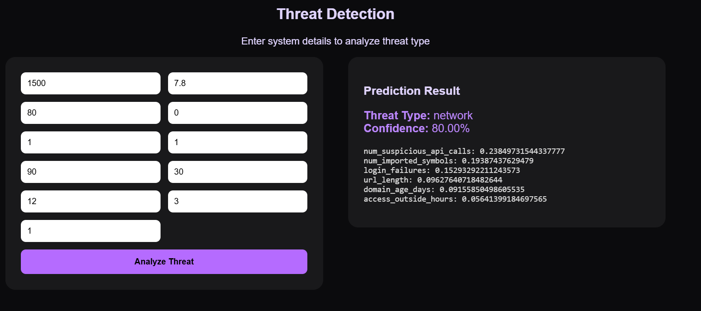

# CyShield – Cyber Threat Detection System

CyShield is an AI-powered cybersecurity system that detects and classifies cyber threats using Machine Learning and Explainable AI (SHAP).

---

##  Features
- Multiclass threat detection
- Random Forest & Gradient Boosting models
- SHAP-based explainability
- Interactive dashboard
- FastAPI backend
- Real-time prediction

---

##  System Architecture

---

##  Dashboard Preview

### Home & Analytics

### Threat Prediction

### SHAP Explainability

---

##  Tech Stack
- Python
- FastAPI
- Scikit-learn
- SHAP
- HTML / CSS / JavaScript
- Chart.js

---

##  Project Structure
Cyshield/
│
├── cyshield-backend/
│   ├── app.py
│   ├── artifacts/
│   └── requirements.txt
│
├── dashboard.html
├── style.css
├── screenshots/
│   ├── dashboard.png
│   ├── prediction.png
│   ├── shap.png
│   └── demo.mp4
│
└── README.md

## Explainable AI (XAI)

CyShield uses SHAP (SHapley Additive exPlanations) to:
1. Explain why a prediction was made
2. Show feature contribution
3. Improve trust and transparency
4. Help security analysts understand threats

## Author

Ananya Singh
B.Tech – Artificial Intelligence & Machine Learning
Cybersecurity | Explainable AI | Machine Learning

